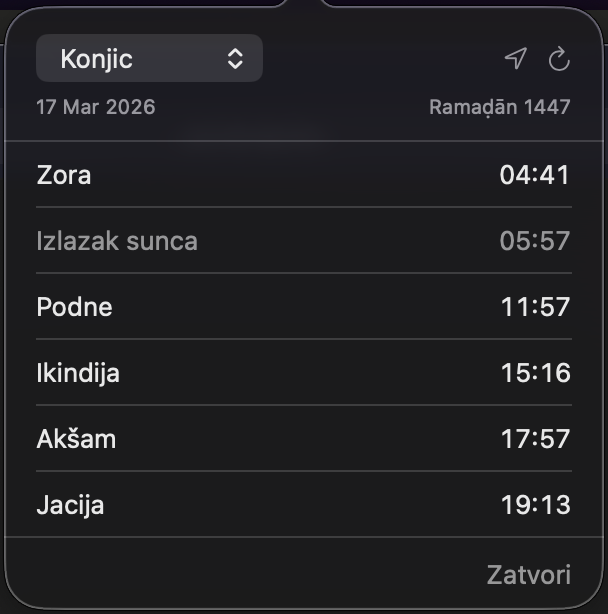
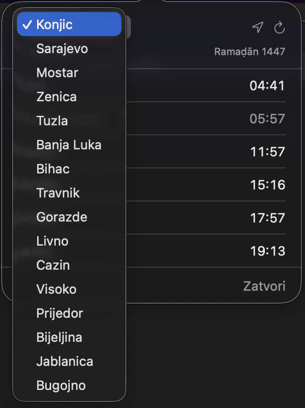

# VaktijaDev

Minimalna macOS menu bar aplikacija za praćenje vaktije (namaz vremena) u gradovima Bosne i Hercegovine.


## Pregled

<p align="center">
  
  
</p>

## Mogućnosti

- Prikaz 5 dnevnih namaza + izlazak sunca
- Hidžretski i gregorijanski datum
- Automatsko označavanje sljedećeg namaza
- 16 gradova iz BiH
- Opcija "Koristi moju lokaciju" — GPS za korisnike koji ne nađu svoj grad
- Račun sa uglom od 14.5° za sabah i jaciju — [zašto 14.5°?](https://github.com/brascene/VaktijaDev/wiki)
- Bez Dock ikone — živi samo u menu baru

## Instalacija

### Opcija 1 — Preuzmi gotovu aplikaciju

1. Idi na [Releases](https://github.com/brascene/VaktijaDev/releases) stranicu
2. Preuzmi `VaktijaDev.app.zip`
3. Raspakiraj i premjesti `VaktijaDev.app` u `/Applications`
4. Desni klik na app → **Open** (samo prvi put, zbog Gatekeeper zaštite)
5. Ako macOS i dalje ne dozvoljava otvaranje — idi u **System Settings → Privacy & Security**, skrolaj do dna i klikni **Open Anyway**

### Opcija 2 — Izgradi sam iz koda

Potrebno: Xcode 15+ i macOS 14+

```bash
git clone https://github.com/brascene/VaktijaDev.git
cd VaktijaDev
xcodebuild -scheme VaktijaDev -configuration Release build
```

Aplikacija će biti u:
```
~/Library/Developer/Xcode/DerivedData/VaktijaDev-*/Build/Products/Release/VaktijaDev.app
```

Ili jednostavno otvori `VaktijaDev.xcodeproj` u Xcode-u i pokreni (⌘R).

## Korištenje

1. Pokreni aplikaciju — ikona mjeseca (🌙) se pojavi u menu baru
2. Klikni na ikonu — otvori se popover sa vaktijom
3. Odaberi grad iz padajućeg menija
4. Ili klikni na ikonu lokacije (📍) da koristiš svoju GPS poziciju
5. Klikni bilo gdje van popovera da ga zatvoriš

## API

Koristi [Aladhan API](https://aladhan.com/prayer-times-api) za dohvat namaz vremena.

- **Po gradu:** `GET https://api.aladhan.com/v1/timingsByCity?city=Sarajevo&country=Bosnia and Herzegovina&method=99&methodSettings=14.5,null,14.5`
- **Po koordinatama (GPS):** `GET https://api.aladhan.com/v1/timings/{timestamp}?latitude=...&longitude=...&method=99&methodSettings=14.5,null,14.5`

Koristi se prilagođena metoda (method=99) sa uglom od **14.5°** za zoru (Fajr) i jaciju (Isha), što odgovara standardu koji se koristi u Bosni i Hercegovini.

## Licenca

MIT — koristi slobodno.
